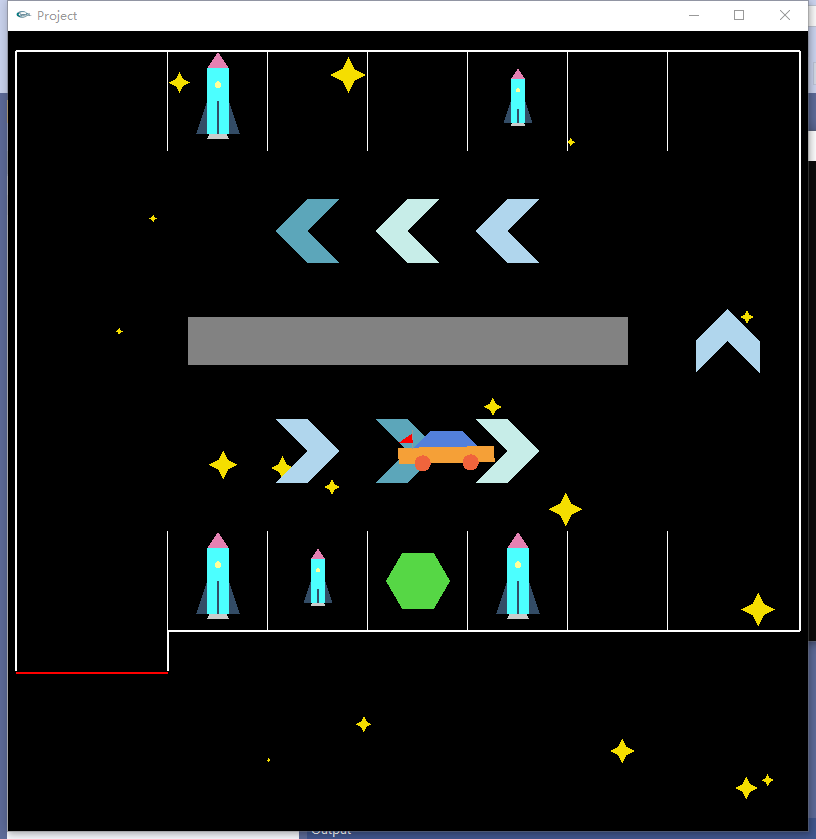
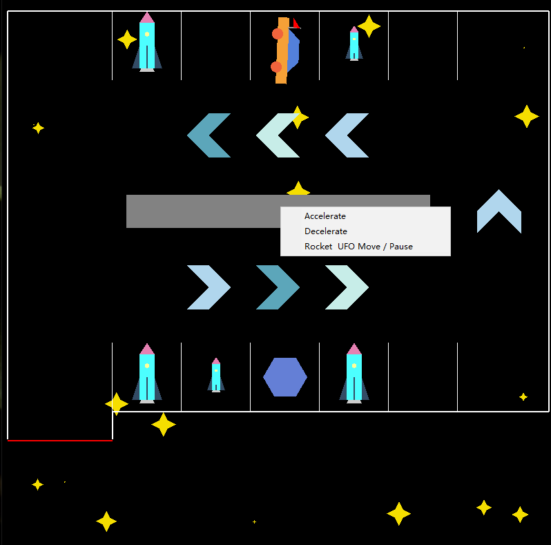

# Interstellar-ParkingLot
This repository provides an Interactive Parking lot Animation Using OpenGL in C++. 

The screenshot of the project is as follows.

 

In this project, a car will drive into the parking lot automatically and find an empty slot to stop. Five rockets will appear in slots of the parking lot randomly, and keep zooming in and out with animation. The stars at the background will also appear in new places randomly every few seconds to pretend to be shining.

There are also interactive control in this project. As shown in the picture below.

 

